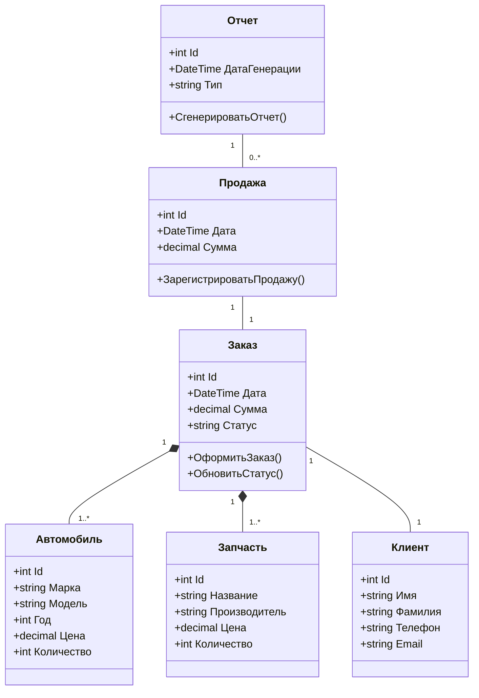
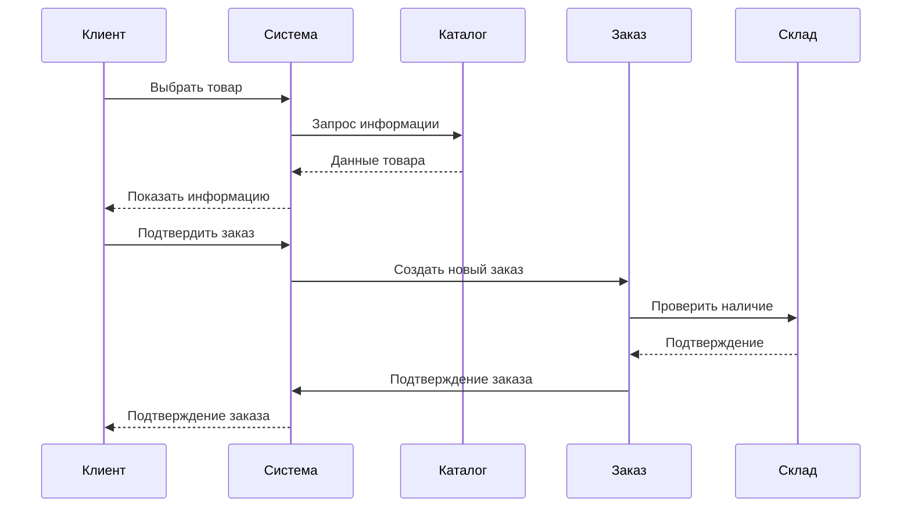
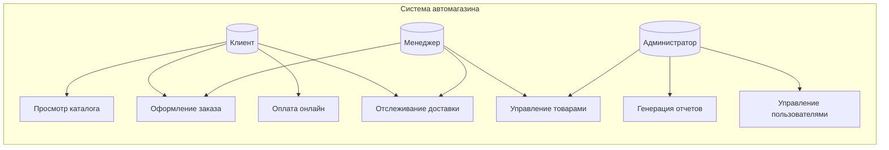

Описание проекта

Ключевые функции:

1)Управление каталогом автомобилей и запчастей

2)Оформление заказов и продаж

3)Управление клиентской базой

4)Генерация отчетов по продажам

5)Управление складскими запасами

Система предназначена для автоматизации работы автомагазина, решающая проблемы:

1)Учета автомобилей, запчастей и аксессуаров

2)Управления заказами клиентов

3)Обработки продаж

4)Ведения базы клиентов

5)Генерации отчетов

1. Диаграмма классов-выбрана как фундаментальная диаграмма, показывающая структуру системы, основные сущности и их взаимосвязи. Помогает понять архитектуру данных приложения.
   
Цель: Показать основные классы системы и их взаимосвязи.

2. Диаграмма последовательностей-выбрана для демонстрации динамики работы системы при выполнении оформление заказа. Показывает временную последовательность взаимодействия объектов.

Цель: Показать взаимодействие объектов при оформлении заказа.

3. Диаграмма вариантов использования-выбрана для описания функциональных возможностей системы с точки зрения различных пользователей. Помогает определить основные требования к системе.

Цель: Описать основные взаимодействия пользователей с системой.

