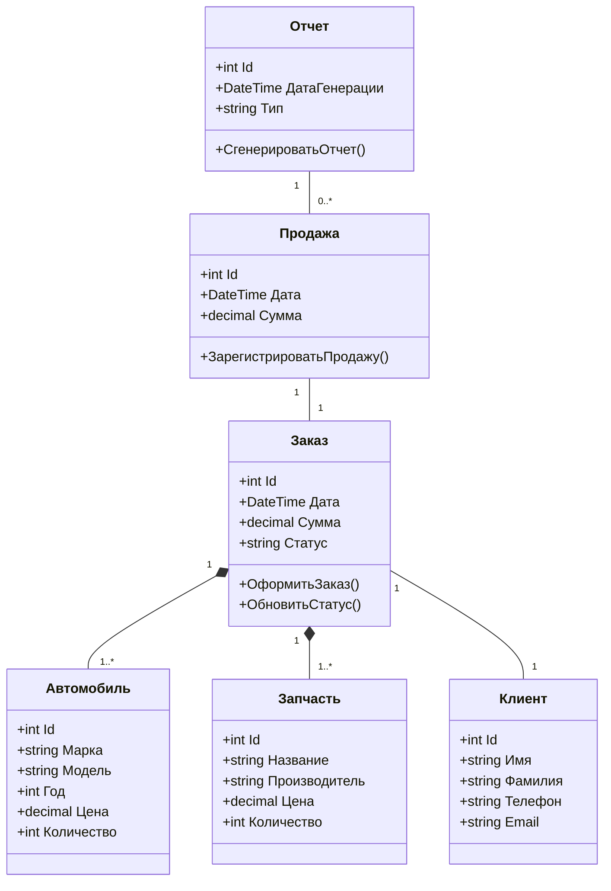
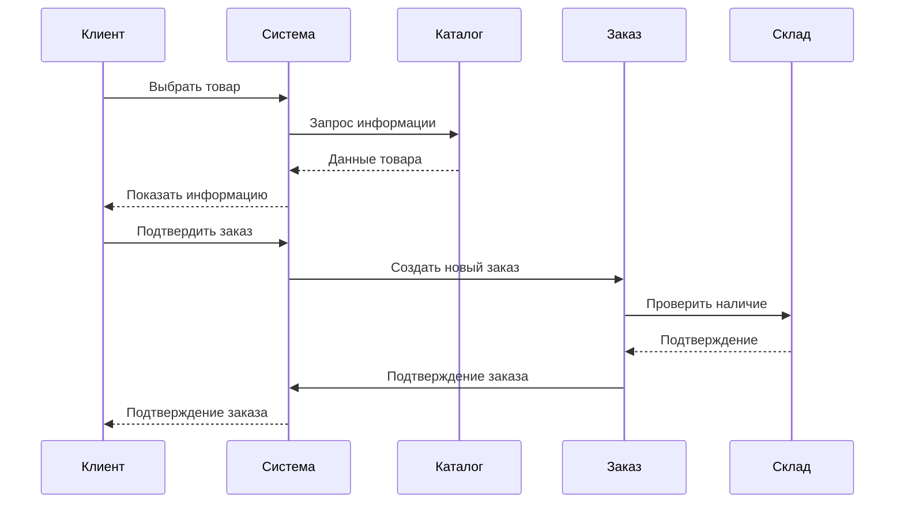
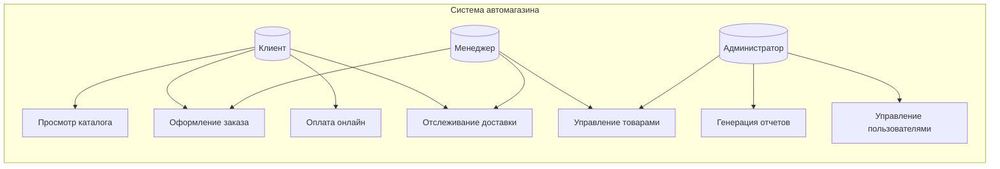

# Описание проекта автомагазин
## Этап 1. Проектирование системы

### Ключевые функции:

- Управление каталогом автомобилей и запчастей

- Оформление заказов и продаж

- Управление клиентской базой

- Генерация отчетов по продажам

- Управление складскими запасами

### Система предназначена для автоматизации работы автомагазина, решающая проблемы:

- Учета автомобилей, запчастей и аксессуаров

- Управления заказами клиентов

- Обработки продаж

- Ведения базы клиентов

- Генерации отчетов

## Диаграмма классов 
Выбрана как фундаментальная диаграмма, показывающая структуру системы, основные сущности и их взаимосвязи. 
   
Цель: Показать основные классы системы и их взаимосвязи.

## Диаграмма последовательностей
Выбрана для демонстрации динамики работы системы при выполнении оформление заказа. Показывает временную последовательность взаимодействия объектов.

Цель: Показать взаимодействие объектов при оформлении заказа.

## Диаграмма вариантов использования
выбрана для описания функциональных возможностей системы с точки зрения различных пользователей. Помогает определить основные требования к системе.

Цель: Описать основные взаимодействия пользователей с системой.

# Этап 2. Создание базы данных

База данных содержит 7 основных таблиц:
1. Cars - информация об автомобилях
2. Manufacturers - производители автомобилей
3. CarTypes - типы кузова
4. Customers - данные клиентов
5. Orders - информация о заказах
6. OrderDetails - детали заказов
7. Inventory - данные о наличии автомобилей

### Основные связи:
- Каждый автомобиль относится к одному производителю (один-ко-многим)
- Каждый автомобиль имеет один тип кузова (один-ко-многим)
- Каждый автомобиль имеет одну запись в инвентаре (один-к-одному)
- Клиент может иметь несколько заказов (один-ко-многим)
- Заказ может содержать несколько автомобилей (многие-ко-многим через OrderDetails)
 
# Тестовые запросы для проверки

 1. Проверка всех автомобилей

`SELECT * FROM Cars;`

2. Проверка связи автомобилей с производителями

`SELECT m.Name AS Manufacturer, c.Model, c.ProductionYear, c.Price
FROM Cars c
JOIN Manufacturers m ON c.ManufacturerID = m.ManufacturerID;`

3. Проверка статусов автомобилей

`SELECT c.Model, i.Status, i.Location
FROM Cars c
JOIN Inventory i ON c.CarID = i.CarID;`

4. Проверка заказов

`SELECT c.FirstName + ' ' + c.LastName AS Customer, o.OrderDate, o.TotalAmount
FROM Orders o
JOIN Customers c ON o.CustomerID = c.CustomerID;`

# Этап 3. Реализация “слоя представления” - консоли

## Основные команды консольного интерфейса автомагазина: 
- Просмотр всех авто - показывает список всех машин с ID, маркой, моделью, годом и ценой

- Добавить авто - добавляет новую машину (требует ввода марки, модели, года и цены с проверкой данных)

- Найти по ID - ищет машину по номеру ID и показывает полную информацию

- Изменить данные - позволяет редактировать информацию о существующей машине (можно менять отдельные поля)

- Удалить авто - удаляет машину из системы по ID

- Выход - закрывает программу

## Особенности:

- Простое меню с цифровым выбором действий

- Проверка вводимых данных

- Защита от ошибок ввода

- Наглядное отображение информации

**Все команды работают с базой автомобилей через сервисный слой, обеспечивая надежное хранение и обработку данных.**

# Этап 4. Реализация слоя работы с БД

## Структура слоя:

| Обозначение | Для чего используется |
| ----------- | ----------- |
| DatabaseConfig   |содержит строку подключения к БД|
| ICarRepository   | интерфейс репозитория с базовыми CRUD-операциями   |
|GetAll|Получения всех автомобилей|
|GetById|Поиска по ID|
|Add|Добавления нового авто|
|Update|Обновления данных|
|Delete|Удаления авто|
|CarService|бизнес-логика с валидацией, использующая репозиторий|

---

## Особенности реализации:

- Инкапсуляция логики работы с БД в репозитории

- Внедрение зависимостей через интерфейс репозитория

- Полная обработка ошибок на всех уровнях

- Проверки целостности данных на уровне БД

---
## Требования:

- SQL Server

- Созданная база данных с таблицей Cars
  
---

## Для использования необходимо:

- Создать базу данных CarShop

- Выполнить SQL-скрипт создания таблицы

- Настроить строку подключения в DatabaseConfig

- Добавить зависимость от Dapper в проект

# Этап 5. Реализация бизнес-слоя

## Основные компоненты:

1. Абстрактный класс Vehicle:

- Базовый класс для всех транспортных средств

- Содержит общие свойства (бренд, модель, год, цена)

- Определяет абстрактные методы для получения типа ТС

- Реализует базовую логику отображения информации
---
2. Классы-наследники (Car, Truck):

- Конкретные реализации транспортных средств

- Добавляют специфические свойства (тип кузова, кол-во дверей для авто; грузоподъемность для грузовиков)

- Переопределяют методы базового класса

---
3. VehicleValidator:

- Статический класс для валидации данных

- Проверяет корректность вводимых значений

- Генерирует исключения при невалидных данных

---

4. VehicleService:

- Основной сервис бизнес-логики

- Содержит методы для работы с транспортными средствами

- Использует репозиторий для доступа к данным

- Реализует дополнительную логику (поиск, расчет общей стоимости)

---

5. IVehicleRepository:

- Интерфейс для работы с хранилищем данных

- Определяет CRUD-операции

## Принципы реализации:

- Наследование (базовый класс Vehicle)

- Полиморфизм (переопределение методов в наследниках)

- Инкапсуляция (скрытие внутренней реализации)

- Разделение ответственности (валидация отдельно от бизнес-логики)

- Зависимость от абстракций (интерфейс репозитория)

---

## Для интеграции с другими слоями:

1. Слой представления работает только с VehicleService

2. VehicleService использует IVehicleRepository для доступа к данным

3. Все сущности представлены через базовый класс Vehicle

